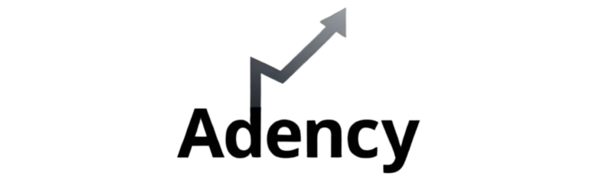

<div align="center">
  
  <h1>🎬 ADENCY – Video Production Agency</h1>
  <p><strong>🌐 Website:</strong> <a href="https://growwithadency.com">growwithadency.com</a></p>
</div>


ADENCY is a modern video production agency focused on creating UGC (User Generated Content), brand promotional videos, and high-impact social media content. This repository contains the high-conversion, cinematic frontend web experience for ADENCY.

## ✨ Our Unique Selling Proposition (USP)

**"Pay Only After Delivery"**
Unlike traditional agencies, ADENCY does not require upfront payment. Clients only pay after receiving their final video. This approach builds instant trust, reduces hesitation, and significantly increases conversion rates.

## 🚀 Features

- **Cinematic Experience**: A stunning, full-viewport (100vh) hero section with a glassmorphic navigation bar.
- **3D Camera Showcase**: Integration of interactive retro 3D camera models using React Three Fiber.
- **Smooth Animations**: High-fidelity scroll animations, floating elements, and creative hover interactions powered by GSAP and Framer Motion.
- **"Pure Light" Brand Identity**: Clean, minimalistic, and bright visual style utilizing a cohesive gradient design system.
- **Conversion-Optimized Funnel**: Simplified client onboarding via direct navigation from "Plans" to "Order Details" and instantaneous WhatsApp redirection.
- **Fully Responsive**: Seamless scaling from desktop cinematic layouts to single-column, tap-to-flip portfolio grids on mobile.
- **Smooth Scrolling**: Lenis smooth scroll for a premium, lightweight browsing feel.

## 🎥 3D Asset Integration

Our project incorporates interactive 3D elements to create a cinematic, premium feel. You can explore the 3D retro camera model directly here on GitHub:

👉 **[Click Here to Interact with the 3D Camera Model](public/assets/camera3d.glb)**


## 🛠 Tech Stack

- **Framework**: [Next.js 16+](https://nextjs.org/) (App Router)
- **UI Library**: [React 19](https://react.dev/)
- **Styling**: [Tailwind CSS v4](https://tailwindcss.com/)
- **Animations**: [GSAP](https://gsap.com/) & [Framer Motion](https://www.framer.com/motion/)
- **3D Integration**: [@react-three/fiber](https://docs.pmnd.rs/react-three-fiber/) & [@react-three/drei](https://github.com/pmndrs/drei)
- **Scrolling**: [Lenis](https://lenis.studiofreight.com/)

## 📂 Project Structure Flow

1. **Landing / Hero Page**: Initial cinematic impression focusing entirely on visual impact.
2. **Services Overview**: Breakdown of UGC, Brand Ads, and Social Media content.
3. **Portfolio**: A rich multimedia grid showcasing product, indoor, and outdoor video content.
4. **Plans & Pricing**: Transparent pricing starting from ₹2000 for ASM/CSM categories.
5. **Checkout & Form**: Client details collection pre-filled and securely redirected to a WhatsApp API conversation.

## 💻 Getting Started

First, ensure you have your dependencies installed:

```bash
npm install
```

Start the development server:

```bash
npm run dev
```

Open [http://localhost:3000](http://localhost:3000) with your browser to see the outcome.

## 🤝 Core Philosophy

The entire ADENCY platform is constructed on three key pillars:
1. **Trust**: Zero upfront costs, clear communication, hidden-cost free.
2. **Visual Impact**: Seamless video playbacks, 3D elements, creative aesthetics.
3. **Simplicity**: Effortless navigation, transparent plan cards, and 1-click WhatsApp onboarding.

---

## 📈 Ready to Elevate Your Brand?

**We don't just build projects; we build scalable digital solutions that convert.** 

Whether you need a high-end cinematic web presence, premium UGC content, or a direct-response funnel that turns clicks into clients, **we** are your growth partners. This project serves as a showcase of our commitment to quality, trust (*"Pay Only After Delivery"*), and seamless user experience.

Want to work together to scale your brand to the next level? 
👉 **Visit our agency:** [growwithadency.com](https://growwithadency.com)  

---
## 👨‍💻 Credits

This entire project was designed and developed by:
- **Arnav Paniya** ([@arnavpaniya](https://github.com/arnavpaniya))
- **Adarsh Gautam** ([@aadigauttam](https://github.com/aadigauttam))
- **Utkarsh Jain** ([@Utkarshjain1217](https://github.com/Utkarshjain1217))
